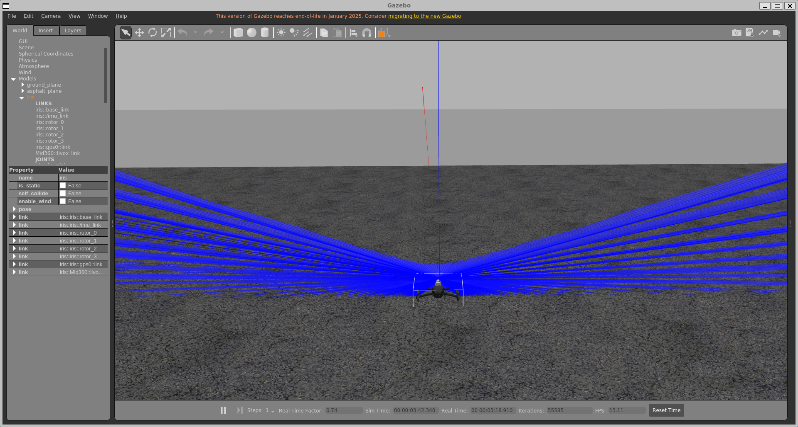

# Mid360_simulation_plugin
Plugin for the simulation of the Livox Mid-360 based on the [official plugin](https://github.com/Livox-SDK/livox_laser_simulation)

Main changes:
- Support for ROS Noetic
- Support for Gazebo 11
- Standalone
    - No need to install the livox ros driver
    - No need to install the livox sdk
- Support for custom message formats
- Corrected the distortion of the point cloud

# 修改
- 在插件中添加了自体滤波，避免扫到无人机
- 添加了搭载Mid360的无人机模型

## 构建

### Tested on
| OS    | COMPILER       | Cmake version  |
| --- |----------------| -------------- |
| Ubuntu 20.04 | GCC >= 9.4     | > 3.16.3         |


1. Clone this repo into your catkin workspace src folder.
```bash
cd ~/catkin_ws/src
git clone https://github.com/Tfly6/Mid360_px4_sim_plugin.git
```

2. Build the plugin.
```bash
cd ~/catkin_ws
catkin build
```

## 运行

1. 为验证插件是否正常工作，你可以运行这个最小化示例：:
```bash
source ~/catkin_ws/devel/setup.bash
roslaunch livox_laser_simulation test_pattern.launch
```
你应该能在 RViz 中看到一个点云，并且在 Gazebo 窗口中看到一个旋转的激光。


在左侧，你可以看到原始插件生成的点云；在右侧，则是此插件生成的点云。左侧图像中的畸变清晰可见。 

2. iris_mid360

<font color="red">**带Mid360的无人机Gazebo仿真运行流畅度，跟电脑性能和World里面的环境有关** </font>
- 复制必要文件到 px4 的目录中。
**${YOUR_PX4_PATH} 替换成你自己的PX4目录路径**
```bash
cd ~/catkin_ws
cp ./src/Mid360_px4_sim_plugin/livox_laser_simulation/launch/mavros_posix_sitl_mid360.launch ${YOUR_PX4_PATH}/launch/

# PX4 版本 < 1.14.0
cp ./devel/lib/liblivox_laser_simulation.so ${YOUR_PX4_PATH}/build/px4_sitl_default/build_gazebo/
cp -r ./src/Mid360_px4_sim_plugin/livox_laser_simulation/models/Mid360 ${YOUR_PX4_PATH}/Tools/sitl_gazebo/models/
cp -r ./src/Mid360_px4_sim_plugin/livox_laser_simulation/models/iris_mid360 ${YOUR_PX4_PATH}/Tools/sitl_gazebo/models/

# PX4 版本 >= 1.14.0
cp ./devel/lib/liblivox_laser_simulation.so ${YOUR_PX4_PATH}/build/px4_sitl_default/build_gazebo-classic/
cp -r ./src/Mid360_px4_sim_plugin/livox_laser_simulation/models/Mid360 ${YOUR_PX4_PATH}/Tools/simulation/gazebo-classic/sitl_gazebo-classic/models/
cp -r ./src/Mid360_px4_sim_plugin/livox_laser_simulation/models/iris_mid360 ${YOUR_PX4_PATH}/Tools/simulation/gazebo-classic/sitl_gazebo-classic/models/

```
- 测试
```bash
source ~/.bashrc
roslaunch px4 mavros_posix_sitl_mid360.launch
```
效果如下图，雷达默认斜向下装，垂直和水平扫描范围非360°


## 参数说明

要将该插件添加到你的机器人模型中，需在你的 SDF 文件中添加以下几行代码：

```xml
<sensor type="ray" name="laser_livox">
        <pose>0 0 0.05 0 0 0</pose>
        <visualize>true</visualize>
        <always_on>True</always_on>
        <update_rate>10</update_rate>
        <!-- This ray plgin is only for visualization. -->
        <plugin name="gazebo_ros_laser_controller" filename="liblivox_laser_simulation.so">
			  <ray>
			  <scan>
				   <horizontal> <!--水平扫描范围 -->
				    <samples>100</samples>
				    <resolution>1</resolution>
				    <min_angle>-3.1415926535897931</min_angle>
            <max_angle>3.1415926535897931</max_angle>
				  </horizontal>
				  <vertical> <!--垂直扫描范围 -->
				    <samples>50</samples>
				    <resolution>1</resolution>
				    <min_angle>-3.1415926535897931</min_angle>
            <max_angle>3.1415926535897931</max_angle>
				  </vertical>
			  </scan>
			  <range>
				  <min>0.1</min>
				  <max>40</max>
				  <resolution>1</resolution>
			  </range>
			  <noise>
				  <type>gaussian</type>
				  <mean>0.0</mean>
				  <stddev>0.0</stddev>
			  </noise>
			  </ray>
        <visualize>True</visualize>
        <samples>20000</samples>
        <downsample>1</downsample>
        <csv_file_name>mid360-real-centr.csv</csv_file_name>
        <publish_pointcloud_type>2</publish_pointcloud_type>
        <ros_topic>/livox/lidar</ros_topic>
        <frameName>livox_link</frameName>
        <!-- self-filter -->
        <enable_self_filter>false</enable_self_filter> 
        <debug>false</debug>
        </plugin>
      </sensor>
```
### 参数
主要参数如下：
 - `enable_self_filter`: 如果设置为true，插件将开启自体滤波，避免点云打在机身上。
 - `debug`: 如果设置为true，插件将输出一些debug消息。
 - `visualize`：如果设置为true，插件将在Gazebo中可视化激光，这对调试很有用，但你可以考虑关闭它以提高性能。
 - `downsample`：下采样因子越高，生成的点数就越少。此参数有助于减轻模拟的计算负担。
 - `publish_pointcloud_type`：这会改变点云发布的格式：
    - `0`：点云将以sensor_msgs::PointCloud消息的形式发布
    - `1`：点云将以sensor_msgs::pointcloud2消息的形式发布，其字段为`x`、`y`、`z`
    - `2`（默认值）：点云将以sensor_msgs::pointcloud2消息的形式发布，其字段为`x`、`y`、`z`、`intensity`、`tag`、`line`、`timestamp`。 
    - `3`：点云将以Livox自定义消息格式发布。 
    ```
    offset_time: 
    x: 
    y: 
    z: 
    reflectivity: 
    tag: 
    line: 

    ```


# ---------------------------------------------

## Citation

If you use this plugin in your research, please cite the following paper:

```bibtex
@Article{isprs-archives-XLVIII-1-W1-2023-539-2023,
AUTHOR = {Vultaggio, F. and d'Apolito, F. and Sulzbachner, C. and Fanta-Jende, P.},
TITLE = {SIMULATION OF LOW-COST MEMS-LIDAR AND ANALYSIS OF ITS EFFECT ON THE PERFORMANCES OF STATE-OF-THE-ART SLAMS},
JOURNAL = {The International Archives of the Photogrammetry, Remote Sensing and Spatial Information Sciences},
VOLUME = {XLVIII-1/W1-2023},
YEAR = {2023},
PAGES = {539--545},
URL = {https://isprs-archives.copernicus.org/articles/XLVIII-1-W1-2023/539/2023/},
DOI = {10.5194/isprs-archives-XLVIII-1-W1-2023-539-2023}
}
```