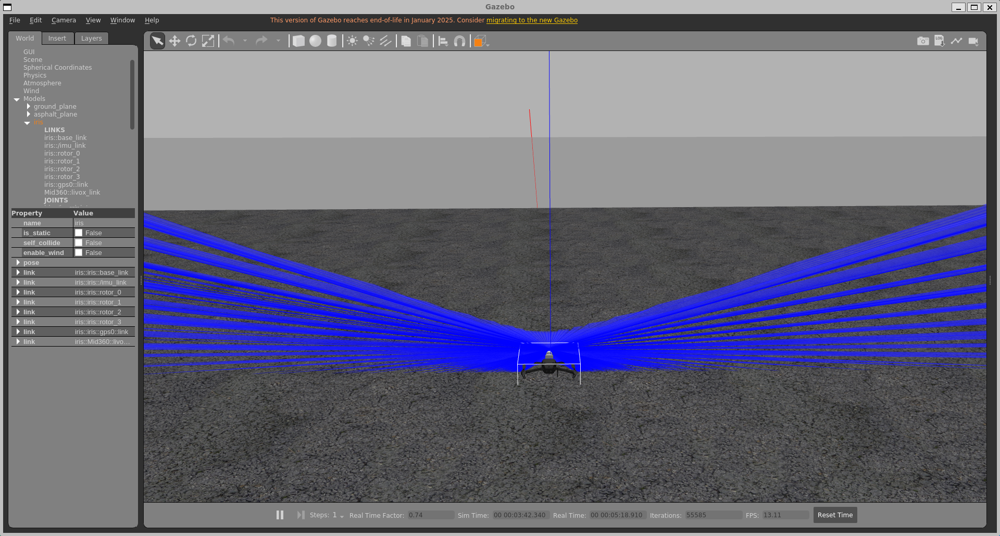

# Mid360_simulation_plugin
Plugin for the simulation of the Livox Mid-360 based on the [official plugin](https://github.com/Livox-SDK/livox_laser_simulation)

Main changes:
- Support for ROS Noetic
- Support for Gazebo 11
- Standalone
    - No need to install the livox ros driver
    - No need to install the livox sdk
- Support for custom message formats
- Corrected the distortion of the point cloud

**If you need to use it in ROS2, please look [ROS2 version](https://github.com/Tfly6/Mid360_px4_sim_plugin/tree/ros2) branch.**

# Modifications
- Added self-filtering in the plugin to prevent scanning the drone's own body
- Added a drone model equipped with Mid360

## Build

### Tested on
| OS    | COMPILER       | Cmake version  |
| --- |----------------| -------------- |
| Ubuntu 20.04 | GCC >= 9.4     | > 3.16.3         |


1. Clone this repo into your catkin workspace src folder.
```bash
cd ~/catkin_ws/src
git clone https://github.com/Tfly6/Mid360_px4_sim_plugin.git
```

2. Build the plugin.
```bash
cd ~/catkin_ws
catkin build
```

## Run

**Note: Ensure there is only one Mid360 model in the Gazebo model path.**

1. To verify the plugin works, you can run this minimal example:
```bash
source ~/catkin_ws/devel/setup.bash
source ~/catkin_ws/src/Mid360_px4_sim_plugin/gazebo_setup.bash # set model path
roslaunch livox_laser_simulation test_pattern.launch
```
You should see a point cloud in RViz and a rotating laser in the Gazebo window.


On the left, you can see the point cloud generated by the original plugin; on the right, the point cloud from this plugin. The distortion in the left image is clearly visible. 

2. iris_mid360

<font color="red">**The simulation smoothness of the Mid360-equipped drone in Gazebo depends on computer performance and the complexity of the world environment.**</font>
- Copy required files into the PX4 directory.
**Replace ${YOUR_PX4_PATH} with your own PX4 directory path**
```bash
cd ~/catkin_ws
cp ./src/Mid360_px4_sim_plugin/livox_laser_simulation/launch/mavros_posix_sitl_mid360.launch ${YOUR_PX4_PATH}/launch/

# PX4 version < 1.14.0
cp ./devel/lib/liblivox_laser_simulation.so ${YOUR_PX4_PATH}/build/px4_sitl_default/build_gazebo/
cp -r ./src/Mid360_px4_sim_plugin/livox_laser_simulation/models/Mid360 ${YOUR_PX4_PATH}/Tools/sitl_gazebo/models/
cp -r ./src/Mid360_px4_sim_plugin/livox_laser_simulation/models/iris_mid360 ${YOUR_PX4_PATH}/Tools/sitl_gazebo/models/

# PX4 version >= 1.14.0
cp ./devel/lib/liblivox_laser_simulation.so ${YOUR_PX4_PATH}/build/px4_sitl_default/build_gazebo-classic/
cp -r ./src/Mid360_px4_sim_plugin/livox_laser_simulation/models/Mid360 ${YOUR_PX4_PATH}/Tools/simulation/gazebo-classic/sitl_gazebo-classic/models/
cp -r ./src/Mid360_px4_sim_plugin/livox_laser_simulation/models/iris_mid360 ${YOUR_PX4_PATH}/Tools/simulation/gazebo-classic/sitl_gazebo-classic/models/

```
- Test
```bash
source ~/.bashrc
roslaunch px4 mavros_posix_sitl_mid360.launch
```
As shown below, the radar is mounted tilted downward by default, with non-360° vertical and horizontal scan ranges.


## Parameters

To add this plugin to your robot model, add the following lines to your SDF file:

```xml
<sensor type="ray" name="laser_livox">
        <pose>0 0 0.05 0 0 0</pose>
        <visualize>true</visualize>
        <always_on>True</always_on>
        <update_rate>10</update_rate>
        <!-- This ray plgin is only for visualization. -->
        <plugin name="gazebo_ros_laser_controller" filename="liblivox_laser_simulation.so">
			  <ray>
			  <scan>
				   <horizontal> <!-- horizontal scan range -->
				    <samples>100</samples>
				    <resolution>1</resolution>
				    <min_angle>-3.1415926535897931</min_angle>
            <max_angle>3.1415926535897931</max_angle>
				  </horizontal>
				  <vertical> <!-- vertical scan range -->
				    <samples>50</samples>
				    <resolution>1</resolution>
				    <min_angle>-3.1415926535897931</min_angle>
            <max_angle>3.1415926535897931</max_angle>
				  </vertical>
			  </scan>
			  <range>
				  <min>0.1</min>
				  <max>40</max>
				  <resolution>1</resolution>
			  </range>
			  <noise>
				  <type>gaussian</type>
				  <mean>0.0</mean>
				  <stddev>0.0</stddev>
			  </noise>
			  </ray>
        <publish_scan_visualization>true</publish_scan_visualization>
        <samples>20000</samples>
        <downsample>1</downsample>
        <csv_file_name>mid360-real-centr.csv</csv_file_name>
        <publish_pointcloud_type>2</publish_pointcloud_type>
        <ros_topic>/livox/lidar</ros_topic>
        <frameName>livox_link</frameName>
        <!-- self-filter -->
        <enable_self_filter>false</enable_self_filter> 
        <debug>false</debug>
        </plugin>
      </sensor>
```
### Parameters
The main parameters are as follows:
 - `enable_self_filter`: If set to true, the plugin enables self-filtering to prevent the point cloud from hitting the drone's own body.
 - `debug`: If set to true, the plugin outputs debug messages.
 - `publish_scan_visualization`: If set to true, the plugin publishes LaserScan messages for visualizing laser scans in Gazebo. Useful for debugging, but you may consider disabling it to improve performance.
 - `downsample`: A higher downsample factor reduces the number of generated points. This helps reduce the computational load of the simulation.
 - `publish_pointcloud_type`: Changes the format of the published point cloud:
    - `0`: Point cloud published as `sensor_msgs::PointCloud`
    - `1`: Point cloud published as `sensor_msgs::PointCloud2` with fields `x`, `y`, `z`
    - `2` (default): Point cloud published as `sensor_msgs::PointCloud2` with fields `x`, `y`, `z`, `intensity`, `tag`, `line`, `timestamp`
    - `3`: Point cloud published in Livox custom message format 
    ```
    offset_time: 
    x: 
    y: 
    z: 
    reflectivity: 
    tag: 
    line: 
    
    ```


---------------------------------------------

# Citation
> The core simulation approach is based on the original work cited below. See Modifications for changes made in this fork.
If you use this plugin in your research, please cite the following paper:

```bibtex
@Article{isprs-archives-XLVIII-1-W1-2023-539-2023,
AUTHOR = {Vultaggio, F. and d'Apolito, F. and Sulzbachner, C. and Fanta-Jende, P.},
TITLE = {SIMULATION OF LOW-COST MEMS-LIDAR AND ANALYSIS OF ITS EFFECT ON THE PERFORMANCES OF STATE-OF-THE-ART SLAMS},
JOURNAL = {The International Archives of the Photogrammetry, Remote Sensing and Spatial Information Sciences},
VOLUME = {XLVIII-1/W1-2023},
YEAR = {2023},
PAGES = {539--545},
URL = {https://isprs-archives.copernicus.org/articles/XLVIII-1-W1-2023/539/2023/},
DOI = {10.5194/isprs-archives-XLVIII-1-W1-2023-539-2023}
}
```